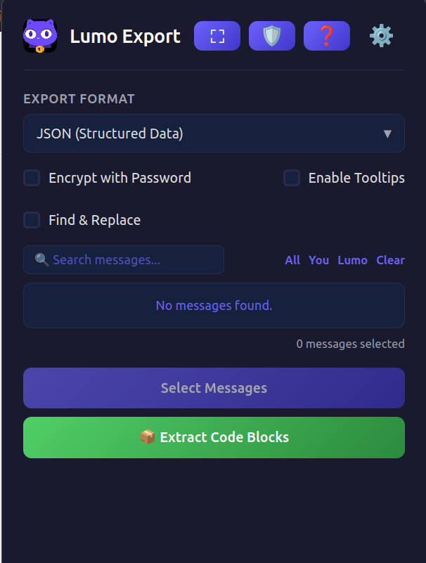
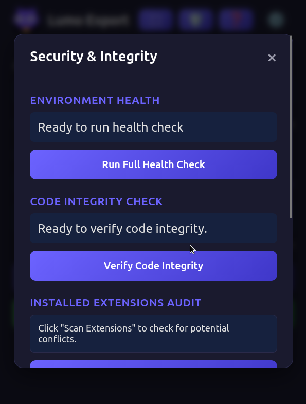
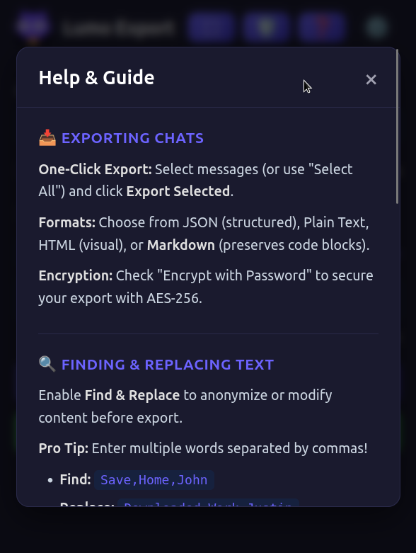
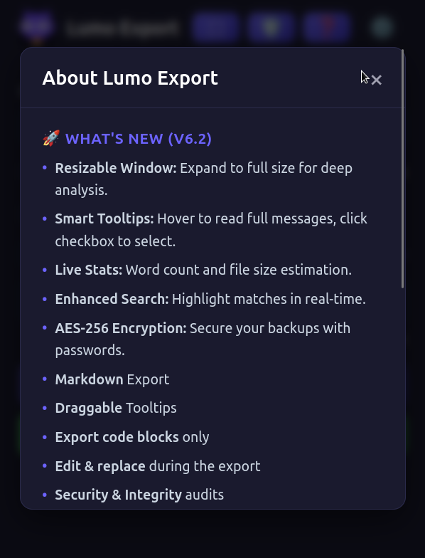

#  Lumo Chat Export

<div align="center">


**Export your Lumo chat history to JSON, TXT, or HTML with a single click.**

[📥 Download on AMO](https://addons.mozilla.org/en-US/firefox/addon/lumo-chat-export/) · [🌐 Landing Page](https://carlostkd.ch/lumo/export) · [🐛 Report Bug](https://github.com/carlostkd/lumo-export/issues)

</div>

HASH VERIFICATION V.7.1

Hash: c10bf3c9144e7e3a4cd742520440f44f6266c220100fb7d77825524f3ea77fa8

Note: Hash verification is performed exclusively on the JavaScript file, as it represents the sole attack vector in this implementation.
```
sha256sum popup.js 
``` 
---

## 🎯 About

**Lumo Chat Export** is a Firefox extension that fills a critical gap in Proton's Lumo interface  the ability to export conversation history. Since Proton doesn't offer a native export feature yet, this extension provides a secure, privacy-focused solution that lets you save your entire chat history in multiple formats.

Then you can Import the chats into Projects.

Or Download in html format for embeded into webpages.

All processing happens **locally in your browser**. Your data never leaves your device.

---

## 📸 Screenshots

| Extension Frontpage | Security Tab |
|:---:|:---:|
|  |  |

| Help & Guide | About |
|:---:|:---:|
|  |  |

## ✨ Features

| Feature | Description |
|---------|-------------|
| ⚡ **One-Click Export** | Instantly save your chat history with a single click. No complex setups. |
| 🔍 **Selective Export** | Choose exactly what to export: **All**, **Only You**, **Only Lumo**, or **Manual Selection**. |
| 🔒 **AES-256 Encryption** | Protect your archives with password-based encryption (PBKDF2 + AES-GCM). |
| 📄 **Multiple Formats** | Export as **JSON** (structured), **Plain Text** (readable), **HTML** (visual), or **Markdown** (preserving code blocks & formatting). |
| 🧹 **Clean Output** | Automatically strips UI elements, thinking paths, buttons, and metadata. |
| 🎨 **Modern Design** | Sleek dark-mode interface with **custom-styled dropdowns** matching the Proton/Lumo ecosystem aesthetic. |
| 🛠️ **Developer Friendly** | Structured JSON output ready for imports, databases, or custom analysis. |
| 🔐 **Zero Data Collection** | All processing happens locally in your browser. No data is sent to any server. |
| 🖥️ **Resizable Window** | Toggle between a compact popup and a **full-size window** for deep analysis. |
| 💬 **Smart Tooltips** | Hover to read full messages in a scrollable tooltip; click checkboxes to select without closing. |
| 📊 **Live Stats** | Real-time word count and estimated file size (KB) for selected messages. |
| 📢 **About & Support** | Built-in modal with release notes, credits, contact info, and a **donation link**. |
| 🔎 **Live Search** | Instantly filter messages by keyword with **highlighted matches**. |
| 📦 **Code Block Extractor** | Scan the entire chat, preview all code snippets, and export them as a single Markdown file or individual text files. |
| 🔀 **Find & Replace** | Anonymize or modify content before export (e.g., swap "client A" with "Project X") with optional case sensitivity. |
| 🛡️ **Security & Integrity** | Built-in health checks, extension conflict detector, injection tester, and permissions overview for complete transparency. |
| 💡 **Smart & Custom Replies** | Access a curated library of predefined technical prompts or create your own saved responses. Includes an **Auto-Send** toggle for rapid workflows. *(Note: Custom replies are stored locally in `localStorage` )* |
---

## 📥 Installation

### Option 1 — From AMO (Recommended)

1. Open Firefox 140 or later
2. Visit the [AMO Store Page](https://addons.mozilla.org/en-US/firefox/addon/lumo-chat-export/) 
3. Click **Add to Firefox**
4. Confirm the installation

### Option 2 — Manual (Development)

1. Clone this repository:

        git clone https://github.com/carlostkd/lumo-export.git
        cd lumo-export
				
2. Open Firefox and navigate to `about:debugging`
3. Click **This Firefox** → **Load Temporary Add-on**
4. Select `manifest.json` from the extension folder
5. The extension icon will appear in your toolbar

> **Note:** For permanent local installation, set `xpinstall.signatures.required` to `false` in `about:config`. See the [Privacy FAQ](#-privacy-faq) below.

---

## 📖 Usage

1. **Open** any Lumo chat page in Firefox
2. **Click** the Lumo Export icon in your toolbar
3. **Select** your preferred format
4. **Click** Export Chat
5. **Done**  your file downloads automatically
6. **Import** Now you can import your chats into Projects 

---

## 📁 Export Formats

### JSON — Structured Data

Best for developers, automation, database imports, and API integrations.

Output structure:

    {
      "exportedAt": "2026-05-10T14:31:01.634Z",
      "totalMessages": 104,
      "messages": [
        {
          "role": "user",
          "content": "Hello Lumo!"
        },
        {
          "role": "assistant",
          "content": "How can I help you today?"
        }
      ]
    }

### Plain Text — Readable Logs

Best for reading, printing, archiving, and quick reference.

Output structure:

    [USER]:
    Hello Lumo!

    ---

    [ASSISTANT]:
    How can I help you today?

    ---

### HTML — Visual Archive

Best for visual archives, sharing with non-technical users, and long-term storage. Opens in any browser with styled conversation bubbles and clean formatting.

---

## 🔒 Privacy

**We take privacy seriously.** This extension:

- ✅ Does **NOT** collect any user data
- ✅ Does **NOT** transmit data to any external server
- ✅ Does **NOT** use analytics or tracking
- ✅ Does **NOT** store data remotely
- ✅ Processes everything **locally in your browser**

The only permissions required:

| Permission | Purpose |
|------------|---------|
| `activeTab` | Read the current Lumo chat page to extract message text |
| `downloads` | Trigger the browser's native file download dialog |

No background scripts. No data collection. No third-party APIs.

---

## ❓ Privacy FAQ

**Is it safe to set `xpinstall.signatures.required` to `false`?**

For personal development use, yes  as long as you only install extensions you trust. This setting bypasses Mozilla's signature verification, so avoid installing random `.xpi` files from untrusted sources. For maximum safety, use a separate Firefox profile for development.

---

## 🤝 Contributing

1. **Fork** the repository
2. **Create** a feature branch: `git checkout -b feature/amazing-feature`
3. **Commit** your changes: `git commit -m 'Add amazing feature'`
4. **Push** to the branch: `git push origin feature/amazing-feature`
5. **Open** a Pull Request

---

## 📄 License

This project is licensed under the **MIT License**. 


---

## 📢 Disclaimer

**Lumo Chat Export is not affiliated with Proton AG.** This is a community-built tool created to enhance the user experience. All trademarks belong to their respective owners.

---

<div align="center">

**Made with ❤️ by Carlostkd**

[⭐ Star this repo](https://github.com/carlostkd/lumo-export)

</div>
